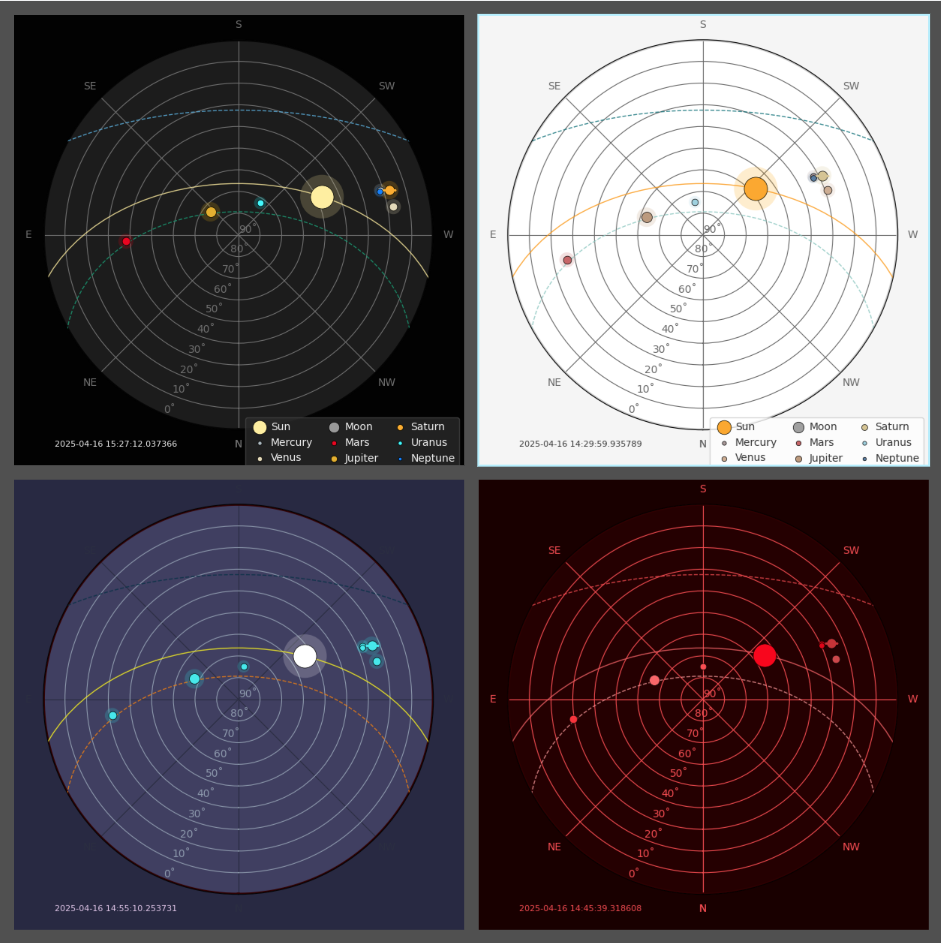

# Live Sun, Moon, and Planets for Home Assistant

[](https://github.com/partofthething/ha_skyfield)

This is a custom component for [Home Assistant ](https://www.home-assistant.io/) 
that makes a live polar sun path chart for your location. Besides the Sun, it
also shows the Moon and a few major planets. Plus, it shows the Winter and Summer solstice sun paths so you can see where you are in the seasons!



This uses the [skyfield library](https://rhodesmill.org/skyfield/) to do the computations. 

To use: 

* Install this in your `custom_components` folder
* Download the prerequisites: `pip3 install skyfield matplotlib numpy` (no longer
  necessary with hassio!)
* Add the following to your home assistant config (refresh interval required):
```yaml
camera:
  platform: ha_skyfield
  refresh_interval: 60   #seconds
```
* Add a picture entity to your GUI with this camera. It will update live.

Optional configuration:

* `refresh_interval` the number of seconds that will elapse between chart updates.  Required, recommend 60 or higher.
* `show_time` add a timestamp to the plot
* `show_legend` add a legend of the bodies
* `show_constellations` enable or disable the constellations (default is True).
* `planet_list` customize which planets are shown
* `constellations_list` customize which constellations are shown (use names from
  [here](https://github.com/partofthething/ha_skyfield/blob/master/custom_components/ha_skyfield/constellations_by_RA_Dec.dat))
* `north_up` (boolean) puts North at the top (useful in the Southern Hemisphere)
* `horizontal_flip` (boolean) flips projection horizontally
* `image_type` (string) Optional - provide image format extension.  Tested options are `png` (default) and `jpg`.
* `default_theme` (string) Optional - this will set the default theme to use if live theme switching is not
   implimented (dark theme default if not defined)
* `color_preset_entity` (string) Optional - this is a Home Assistant entity (input_select dropdown) that will load the preset theme.

Theme colors:

The camera configuration supports user defined themes. Any color not defined will fallback to the colors in the dark theme. 
The structure of the theme definition in the camera configuration is:
`color_presets:
    light:
      <elements>`

Elements and default values:

    Value                Default     # Desription
    
    # Glow around planets
    glow:                true        # true or false. Will put a slight glow around the planets
    
    # Background
    background_outer:    "#0d1b2a"   # Canvas outer color
    background_inner:    "#1b263b"   # Polar plot fill

    # Grid
    grid_circle:         "#0d1b2a"   # The 90˚ circle border
    rgrid_color:         "#e0e1dd"   # Radial grid lines (altitude circles)
    tgrid_color:         "#e0e1dd"   # Angular grid lines (azimuth spokes)

    # Text + Legend
    text:                "#e0e1dd"   # Timestamp and annotations
    legend_face:         "#1b263b"   # Legend background
    legend_edge:         "#0d1b2a"   # Legend border

    # Celestial paths
    solstice_winter:     "#219ebc"   # Winter solstice sun path
    solstice_summer:     "#8ecae6"   # Summer solstice sun path
    sun_today:           "#ffb703"   # Today’s sun arc

    # Planets (must be indented under planets: element)
    planets:
      Sun:              "#FFD700"
      Mercury:          "#FF69B4"
      Venus:            "#BC8F8F"
      Moon:             "#D3D3D3"
      Mars:             "#FF0000"
      Jupiter:          "#D2691E"
      Saturn:           "#F0E68C"
      Uranus:           "#B0C4DE"
      Neptune:          "#4169E1"

    # Optional: Stars & Constellations
    star_color:          "#ffffff"   # Dots for stars
    star_alpha:          0.6         # Transparency for stars
    constellation_color: "#888888"   # Lines between constellation stars
    constellation_linewidth: 0.5     # Thickness of those lines

EXAMPLE CAMERA CONFIGURATION WITH THEMING

```yaml
 camera:
   platform: ha_skyfield
   color_preset_entity: input_select.skyfield_theme
   refresh_interval: 120
   show_constellations: false
   default_theme: dark
   show_legend: true
   color_presets:
     light:
       glow: true
       background_outer: "#f5f5f5"
       background_inner: "#ffffff"
       grid_circle: "#cccccc"
       text: "#333333"
       legend_face: "#ffffff"
       legend_edge: "#cccccc"
       rgrid_color: "#666666"
       tgrid_color: "#666666"
       sun_today: "#ff9900"
       solstice_winter: "#006d77"
       solstice_summer: "#83c5be"
       planets:
         Sun: "#ffaa00"
         Mercury: "#aa9999"
         Venus: "#cfae91"
         Moon: "#a0a0a0"
         Mars: "#cc6666"
         Jupiter: "#be9b7b"
         Saturn: "#d6c690"
         Uranus: "#9bd1e1"
         Neptune: "#587ca3"
     night:
       glow: false
       background_outer: "#1a0000"
       background_inner: "#260000"
       grid_circle: "#330000"
       text: "#ff4d4d"
       legend_face: "#260000"
       legend_edge: "#330000"
       rgrid_color: "#ff4d4d"
       tgrid_color: "#ff4d4d"
       sun_today: "#ff6666"
       solstice_winter: "#ff4d4d"
       solstice_summer: "#ff9999"
       planets:
         Sun: "#ff0000"
         Mercury: "#cc0000"
         Venus: "#d14747"
         Moon: "#993333"
         Mars: "#ff3333"
         Jupiter: "#ff6666"
         Saturn: "#cc3333"
         Uranus: "#ff4d4d"
         Neptune: "#e60000"
     twilight:
       glow: true
       background_outer: "#282843"
       background_inner: "#403d63"
       grid_circle: "#330000"
       text: "#e6c8ee"
       legend_face: "#f4f1de"
       legend_edge: "#ffb703"
       rgrid_color: "#8e9aaf"
       tgrid_color: "#2b2d42"
       sun_today: "#ffff00"
       solstice_summer: "#fb8500"
       solstice_winter: "#023047"
       stars: "#ffb8fe"
       moon: "#abacd1"
       planets:
         Mercury: "#1ee8ed"
         Venus: "#1ee8ed"
         Earth: "#1ee8ed"
         Mars: "#1ee8ed"
         Jupiter: "#1ee8ed"
         Saturn: "#1ee8ed"
         Uranus: "#1ee8ed"
         Neptune: "#1ee8ed"
         Pluto: "#1ee8ed"
     dark:
       glow: true
       background_outer: "#020202"
       background_inner: "#1c1c1c"
       grid_circle: "#050505"
       text: "#f0f0f0"
       legend_face: "#2a2a2a"
       legend_edge: "#444444"
       rgrid_color: "#707070"
       tgrid_color: "#707070"
       sun_today: "#fff09a"
       solstice_winter: "#56b4e9"
       solstice_summer: "#009e73"
       planets:
         Sun: "#fff09a"
         Mercury: "#adbbc3"
         Venus: "#e5dbb6"
         Moon: "#999999"
         Mars: "#ef000f"
         Jupiter: "#e6b200"
         Saturn: "#ffb000"
         Uranus: "#00f9ff"
         Neptune: "#0079ff"
```

LIVE THEME SWITCHING

Create a input_select dropdown with the preset names defined in the camera yaml.  Select theme and the theme will apply.  
Useful for automations (i.e. based on time of day or astronomical event)

Known Issues:

* WARNING: High CPU usage! The underlying library is relatively long-running. Disable or
  limit constellations if you're using a smaller computer, like a Raspberry Pi. Even with
  them off, the CPU load may unacceptable. Options and more 
  discussion in [#4](https://github.com/partofthething/ha_skyfield/issues/4)

* Does not follow Home Assisant theme because of matplotlib backend (see
  [#5](https://github.com/partofthething/ha_skyfield/issues/4)

* More (maybe) at [Issues](https://github.com/partofthething/ha_skyfield/issues)

Inspiration comes from the University of Oregon 
[Solar Radiation Monitoring Lab](http://solardat.uoregon.edu/PolarSunChartProgram.html).


